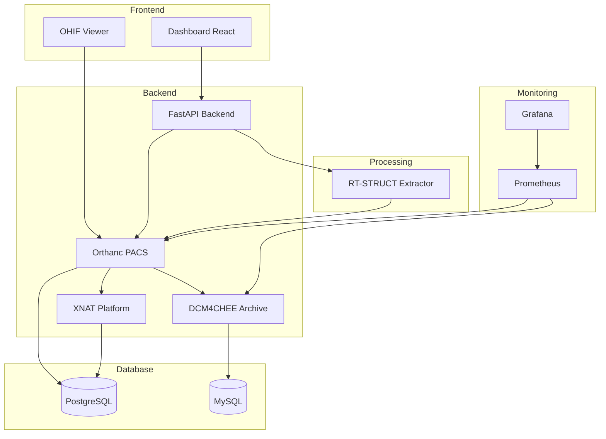

# Vue d Ensemble de l Architecture

Architecture globale de la plateforme PACS multi-systemes.

## Diagramme de l Architecture

## Technologies Principales

| Composant | Technologie | Version | Port |
|-----------|------------|---------|------|
| Dashboard | React + Vite | Latest | 3000 |
| OHIF | React | 3.x | 3001 |
| Backend | FastAPI | Latest | 8000 |
| Orthanc | C++ | 1.12.x | 8042 |
| DCM4CHEE | Java EE | 5.x | 8082 |
| XNAT | Java | 1.8.x | 8081 |
| Grafana | Go | 10.x | 3002 |
| Prometheus | Go | Latest | 9090 |

## Flux de Donnees

### Upload DICOM
1. Utilisateur upload fichier via Dashboard
2. Dashboard envoie a l API FastAPI
3. API transfere vers Orthanc
4. Orthanc stocke et notifie les autres systemes

### Visualisation
1. Utilisateur ouvre OHIF Viewer
2. OHIF se connecte a Orthanc via DICOMweb
3. Images affichees dans le viewer

### Extraction RT-STRUCT
1. API detecte fichier RT-STRUCT
2. Envoie vers RT-Extractor
3. Extractor analyse les contours
4. Resultats sauvegardes et disponibles

### Monitoring
1. Prometheus scrape les metriques
2. Grafana affiche les dashboards
3. Alertes configurables

## Securite

- Authentification pour tous les services
- Mots de passe stockes dans .env
- HTTPS recommande en production
- Isolation des conteneurs Docker

## Scalabilite

La plateforme peut etre scalee horizontalement:
- Plusieurs instances Orthanc
- Load balancing pour le Dashboard
- Base de donnees en cluster

Pour plus de details techniques, voir [Microservices](microservices.md).
